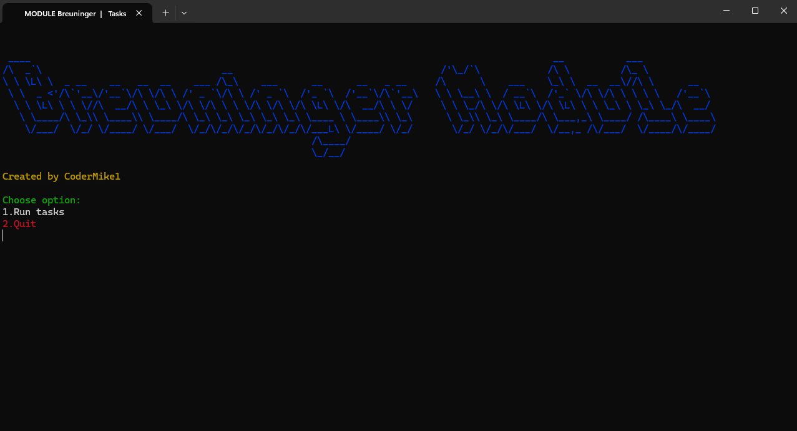
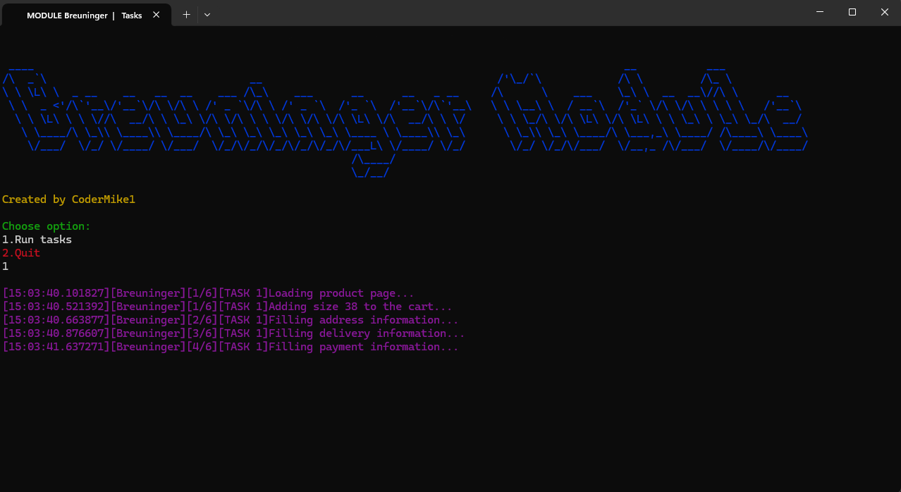
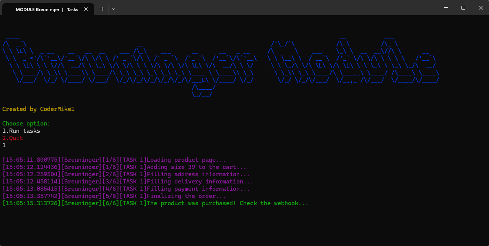

# 🏡 A bot supporting shopping in a clothing/sneaker store


## 📝 **Table of contents**
* [General info](#-general-info)
* [Setup](#-setup-and-run)
* [SCREENSHOTS](#-screenshots)
---
## 🚀 **General info**
- Automation process of checking out products on popular website Breuninger
- Available purchases on 9 regions included (**AT, BE, CH, CZ, DE, ES, IT, NL, PL**)
- Comfortable way to pay (*paypal link*)
- Possibility to run many tasks in the same time
- Logs of the checkout process are saved in .txt file
---

## 📦 **Setup and run**

### 🔹 **1. Run on your device**
```bash
git clone https://github.com/CoderMike1/sneaker-module.git
cd sneaker-module
python -m venv venv
venv\Scripts\activate
pip install -r requirements.txt
```

**Fill data in tasks.csv**
- Link - url link to the product
- Size - EU format size like 38 / 40.5 / 47.5 , you can use size range ex. 39-40.5
- Quantity - number 
- Proxy - please put in this format host:port:login:password
- Delay - number
- Email
- First Name
- Last Name
- Street
- House number
- Apartment number  -if exists
- City
- Zip code - depends on country use various formats : XX-XXX , XX XXX, XXX XX
- Country - ISO code : PL, DE, CZ etc.
- Phone Number - please insert number with prefix
- Discord Webhook URL - to get notification about purchases you need to insert Webhook URL [How to create it](https://www.youtube.com/watch?v=fKksxz2Gdnc)
---
**After completing data in .csv you need to run one more command**
```bash
python script.py
```
## 📷 **Screenshots**
<p align="center">
  
  
  
</p>
